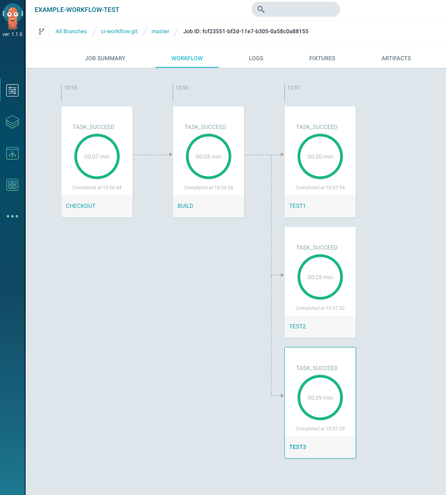

Argo CI vs Jenkins BlueOcean comparison
=================================

## UI

### Design

Both Argo CI and Jenkins BlueOcean UI looks petty good. Jenkins Blue Ocean still don't support all required features and might redicted user back to old ugly Jenkins UI. e.g. if
user tries to configure pipeline or change Jenkins system settings.

| Argo          | Jenkins     |
| ------------- |-------------|
|        |  |


Personally I like Argo 'look and feel' more. **Winner**: Argo

### Features & Usability

Jenkins BlueOcean UI is easier to use because it is more CI focused. I see following advantages:

 - Jenkins job details page has all required information on one screen: compact pipleline graph; logs on one step; branch; commit; duration; commiter and submitter.
 - Jenkins allows to run mutliple scripts for each step and shows logs for each separatly. So instead of writing something like
   `cd /src && npm install && npm run tslint && npm run build` it is possible to write following and browse logs separatly:
   ```
   steps {
    sh 'npm install'
    sh 'npm run tslint'
    sh 'npm run build'
   }
   ```
 - Jenkins CI specific features like tests UI, link to branch on gibhut/bitbucket etc.
 - Since repo has exactly one pipeline, Jenkins might show most recent branch state.

**Winner**: Jenkins

### First User experience

Jenkins first user experience was smoother. Jenkins BlueOcean provides very simple editor which helps to connect repo and create sample pipeline. Argo first user experience tries
to teaches about Argo UI and point to tutorials instead of helping to do it in-place.

**Winner**: Jenkins

## Workflow Engine

### Features

In my opinion Argo workflow is way more advanced than declarative Jenkins pipeline. I could not find any analog of dynamic fixtures, so it is unclear how to define pipelines
which run complex e2e tests. It is unclear how to use different docker images and pass artifacts from step to step; it is unclear how combine artifacts from parallel steps etc.

**Winner**: Argo

### Usability

In my opinion Jenkins pipeline definition is much more cleaner than Argo YAML. Just complare [YAML](https://github.com/alexmt/argo-vs-jenkins/blob/master/Jenkinsfile) and
[Jenkinsfile](https://github.com/alexmt/argo-vs-jenkins/blob/master/Jenkinsfile) for the same job.

**Winner**: Jenkins

## Kubernetes integration

There are several plugins which allows to integrate Jenkins and Kubernetes. I've checked two of them:

* [kubernetes-pipeline-plugin](https://github.com/jenkinsci/kubernetes-pipeline-plugin/blob/master/kubernetes-steps/readme.md). Plugin looks like wrapper on top of kubernetes API
and does not allow to pass artifacts between steps etc. So I don't think it is possible to use it for CI at this point. 

* [kubernetes-plugin](https://github.com/jenkinsci/kubernetes-plugin). This plugin is more sutable for CI. It allows to dynamically start kubernetes pod which executes whole
pipeline.

Configuration was not very straightforward. It looks like [kubernetes-plugin/README.md](https://github.com/jenkinsci/kubernetes-plugin/blob/master/README.md) assumes that user is
familiar with Jenkins. I've tried to use Jenkins declarative pipeline first and encountered limitation: looks like for declarative pipeline user has to configure available container
images separatly, which makes pipeline not portable. I've switched to scripted pipeline. It is possible to request separate pod for each pipeline stage, but I could not find
any way to pass artifacts between such stages. After strugguling for couple hours I've stopped.

**Winner**: Argo
